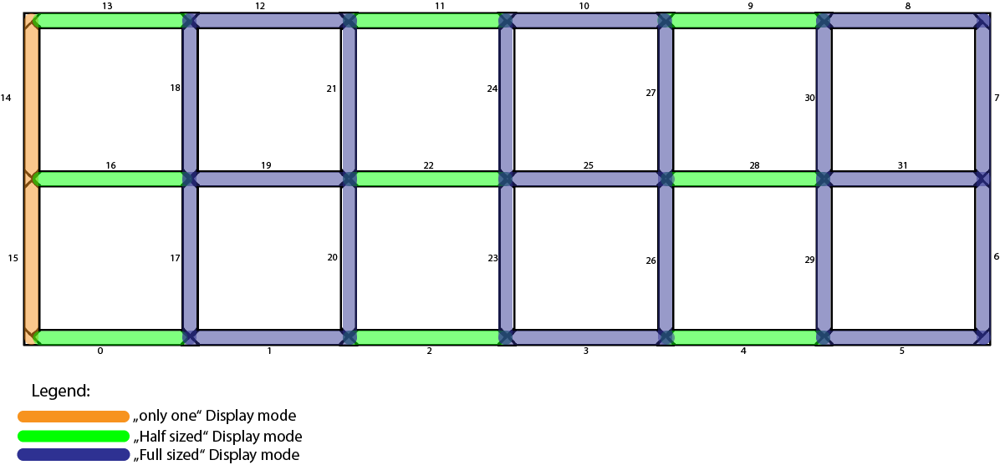

.. _Basic-config:

# Configuring the Code

I designed the code for maximal flexibility. So it is split into multiple parts which I will call units that have one very distinct purpose to them.

## Short overview of the units
 - The main unit: brings together all other units and combines them to make the clock work. Also responsible for Blynk and WIFI init and handling all cyclic tasks. The in app blynk config can be found :doc:`here <Blynk>`
 - SevenSegment: This is the unit that is responsible for managing one seven segment display. It contains code for displaying numbers on the leds.
 - DisplayManager: Contains code to bring together multiple SevenSegment units in order to manage all of them at once through one object. This also contains the initialization functions for the segments.
 - Animator: Responsible for handling animation stages and playing, pausing resetting animations that can be added to any class that inherits the AnimatableObject class.
 - TimeManager: This is a work in progress, but once done it shall be responsible to keep track of the time even if the internet goes down for a few hours

##  Step by Step configuration guide:
In order to get the SW up and running for your particular use case you will have to configure a few things.
I will go over them in an order that makes sense to keep it as clear as possible.
### Step 1
Configure the general feature set that you would like. For that open the `/include/Configuration.h` file and in it you will find a bunch of defines complete with an explanation of what they do. You can choose whether you would like to use Blynk to control your lights from the smartphone, enable or disable OTA updates to make the update process a little easier after the first flash.

IMPORTANT: The OTA update feature does not provide a fool proof method of updating the controller. If you upload a wrong configuration and the micro controller crashes you will need to resort to flashing the controller using a cable.

### Step 2
Also in the same file you have to specify how many leds you use per segment, how many segments there are in total and so on. Everything is explained there in code.

### Step 3
This is the most critical and hardest to understand. You will need to configure the configuration arrays in the file `/src/DisplayManager/DisplayConfiguration.cpp`
These arrays tell the system how you wired up your LEDs.
Open up the file that is provided with the code and take a look at this schema:

Here you can see how I wired up my LEDs. The order of the segments is important and always has to be the same as they are wired.

First it makes sense to look at the arrays called `SegmentPositions` and `SegmentDisplayModes`. You will have to think about to which seven segment display each single segment belongs. Imagine this:

As you can see, in my example there are 3 full sized displays, 3 half sized displays (the ones with just the horizontal segments) and 1 segment which can only display a 1. If you take into account the way I wired the LEDs on the graphic above you can see that the first segment in my strip is the middle bottom segment of the second display from the left which is a "Half display" This is why the first entry in the `SegmentPositions` array is `SevenSegment::MiddleBottomSegment`. Just go through them one by one, think about which display they belong to and what their position is within their display.
 
The `SegmentDisplayModes` array is easy, just put in the display types you have from left to right. You can see the three modes you can choose from in the provided file.

***

Next up is the `SegmentDirections` array. This one is important for animations. You have to tell the program in which direction you wired the LEDs. Just take a look at the first diagram and follow the arrow directions. They will tell you what to put into the array.

***

The final array to configure is the `displayIndex` array. It is used to know which segment belongs to which display. So each position in the array corresponds to the same position in the `SegmentPositions` array. The number you have to put there corresponds to the index number of the entries in the `SegmentDisplayModes` array.
So for example, the first segment in my code is the middle bottom segment of the second display which is a half mode display. So you have to put a 1 there to point the code to the second position of the `SegmentDisplayModes` array.

### Step 4 (optional)
Now you should be at a point where your system should at least compile and display something. Everything onward from here are additional steps and are not needed if you are not concerned with altering the looks of Digits or animations.

If you want to change how a certain number is displayed you will have to go to the file `/src/SevenSegment/SevenSegment.cpp`. On the top here you will find an array which is used to configure which segments to turn on for displaying a certain number.
For example, some people prefer to have the bottom segment turn off when displaying a "9" so if you wanted to do that (My code turns the bottom segment on for 9 by default) you just simply remove the "MiddleBottomSegment" value from the array at it's 9th position.

Be aware that if you alter the looks of the digits you will have to also alter the animation that is used to morph the digits. You can find how to configure animations :doc:`on this page <Advanced-config>`

if you just want to change the speed of how long it takes to morph one digit into another you can do that in the file `/src/DisplayManager/Animations.cpp` by changing the define there.
