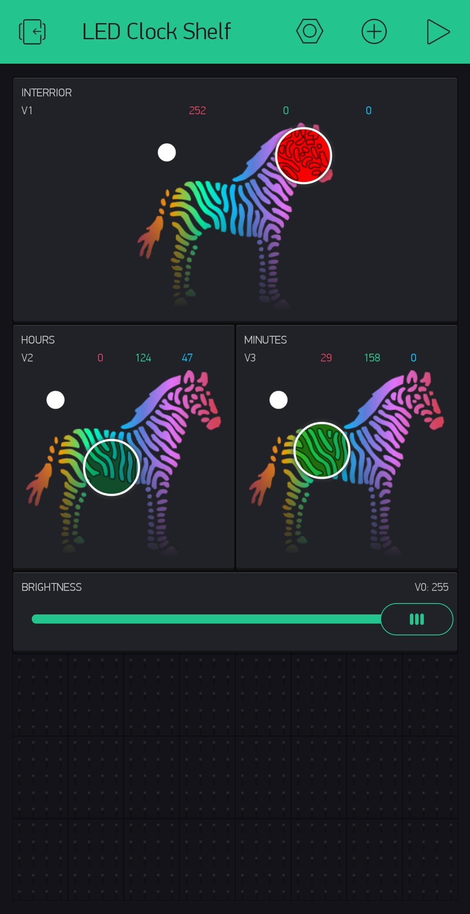
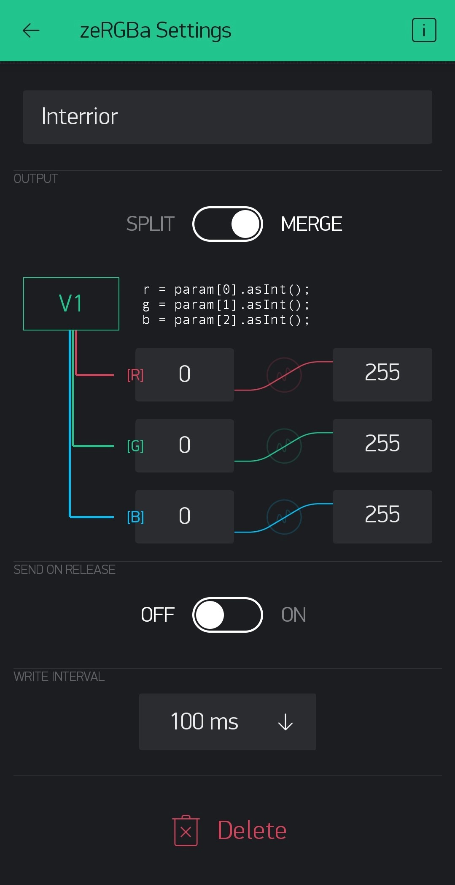

.. _Blynk:

# Blynk configuration

The blynk configuration I am using is pretty basic but it still provides a way to select the color and brightness for the hours and minutes displays and also the interior lights.

My setup looks like this and if you didn't change the code you will have to make sure that you are also outputting to the same virtual pins: 

If you are not interested in the Timer Functionality just simply remove the buttons for it.
If you want to have an easy and quick setup exactly like me you can scan this QR code from inside the Blynk app to get up and running quickly: 

If yu choose to set it up manually be aware that I have set my controls to merge the colors, so you will have to do the same. An additional nice feature to have is to update the clock every 100ms while you are changing the color to see it changing in real time on the shelf itself: 
