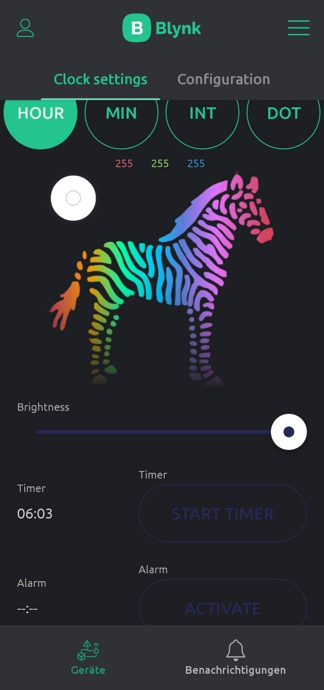
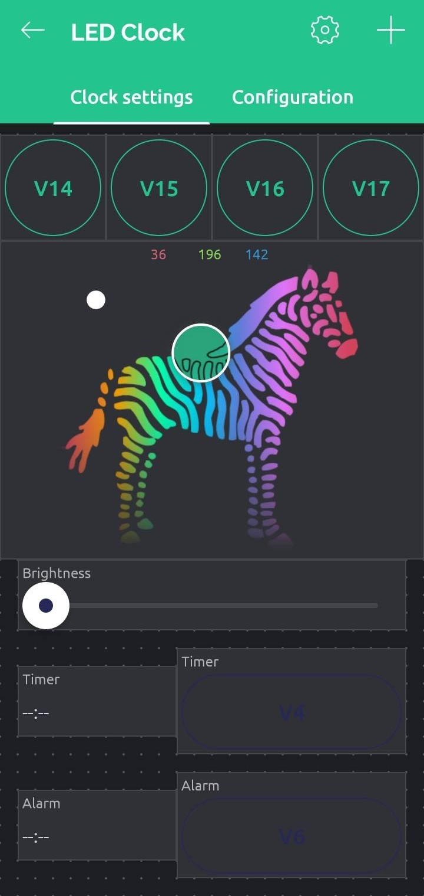
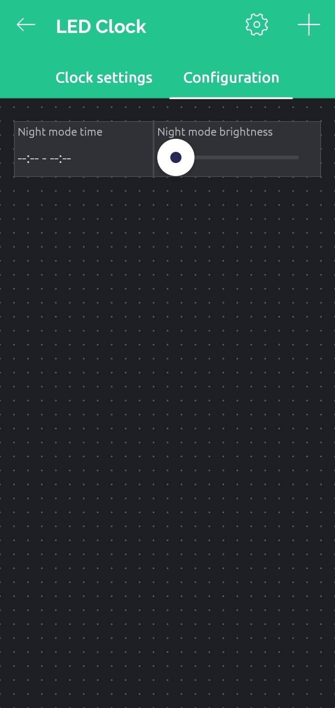

############################
Default blynk config
############################

This configuration is supposed to give all the basic functionality while also staying inside the free tier.

This guide will cover how to setup a dashboard and the datastreams for the new Blynk 2.0

An example of how the dashboard will look like:

****************
Setup guide
****************

Sadly I could not find any way to export my own template, make it public, or share it in any way shape or form with the new blynk cloud.
It seems like this is just simply not possible. So for now I will provide some instructions here on how to replicate my dashboard manually.
If someone knows how to share templates on the new blynk cloud please let me know!

1. Follow the first setup instructions in the blynk cloud interface to create a new device and template.
2. Then in the web app open the template that you just created and go to the Datastreams tab. Here you should create the following datastreams

+--------------------------+------+-----------+-----+-----+---------+
| Name                     | Pin  | Data Type | Min | Max | Default |
+==========================+======+===========+=====+=====+=========+
| LED Brightness           | V0   | Integer   | 0   | 255 | 128     |
+--------------------------+------+-----------+-----+-----+---------+
| Light group selector     | V1   | Integer   | 0   | 4   | 0       |
+--------------------------+------+-----------+-----+-----+---------+
| Current Color            | V2   | String    | -   | -   | -       |
+--------------------------+------+-----------+-----+-----+---------+
| Timer time               | V3   | String    | -   | -   | -       |
+--------------------------+------+-----------+-----+-----+---------+
| Timer start button       | V4   | Integer   | 0   | 1   | 0       |
+--------------------------+------+-----------+-----+-----+---------+
| Alarm time               | V5   | String    | -   | -   | -       |
+--------------------------+------+-----------+-----+-----+---------+
| Alarm start button       | V6   | Integer   | 0   | 1   | 0       |
+--------------------------+------+-----------+-----+-----+---------+
| Night mode time          | V7   | String    | -   | -   | -       |
+--------------------------+------+-----------+-----+-----+---------+
| Night mode Brightness    | V8   | Integer   | 0   | 255 | 0       |
+--------------------------+------+-----------+-----+-----+---------+
| Number of separation dots| V9   | Integer   | 0   | 2   | 0       |
+--------------------------+------+-----------+-----+-----+---------+
| Hour color               | V10  | String    | -   | -   | -       |
+--------------------------+------+-----------+-----+-----+---------+
| Minute color             | V11  | String    | -   | -   | -       |
+--------------------------+------+-----------+-----+-----+---------+
| Internal color           | V12  | String    | -   | -   | -       |
+--------------------------+------+-----------+-----+-----+---------+
| Dot color                | V13  | String    | -   | -   | -       |
+--------------------------+------+-----------+-----+-----+---------+
| Selector Hours           | V14  | Integer   | 0   | 1   | 0       |
+--------------------------+------+-----------+-----+-----+---------+
| Selector Minutes         | V15  | Integer   | 0   | 1   | 0       |
+--------------------------+------+-----------+-----+-----+---------+
| Selector Internal        | V16  | Integer   | 0   | 1   | 0       |
+--------------------------+------+-----------+-----+-----+---------+
| Selector Dot             | V17  | Integer   | 0   | 1   | 0       |
+--------------------------+------+-----------+-----+-----+---------+

1. Now you can start replicating the Dashboard in the app. Here are some screenshots of it. You can see most of the pin associations in the screenshot itself:

Some settings which are not obvious from the screenshots above:

Hour/min/int/dot selectors:
	Should be set to toggle

zeRGBa:
	Pin: V2

	Send on release: false

	Mode: Merge

	send interval: 300ms

	.. note:: **Workaround for iOS users:**

		It seems like blynk has a bug in their RGB widget that will prevent you from selecting the correct virtual pin.
		To get it working you can follow this workaround:

			1. Set the data stream type for V2 to integer in the blynk web dashboard and apply the change
			2. Select V2 as the data stream for the RGB widget and save the changes
			3. Change the data stream type of the V2 pin back to String via the web dashboard, save and apply changes

Brightness Slider:
	Pin: V0

	Send on release: false

	send interval: 300ms

Timer time selector:
	Pin: V3

	Format: HH:mm

	All other options are set to false

Alarm time selector:
	Pin: V5

	Format: HH:mm

	All other options are set to false

Alarm/timer buttons:
	Should be set to toggle

Night mode time selector:
	Pin: V7

	Switch start/stop time input to true

Night time brightness slider:
	Pin: V8

	Send on release: false

	send interval: 300ms

Selection buttons:
	Pins: V14 - V17

	Behavior: Toggle
