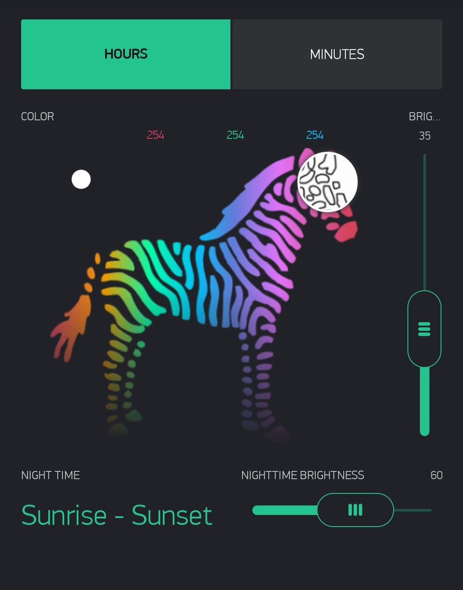
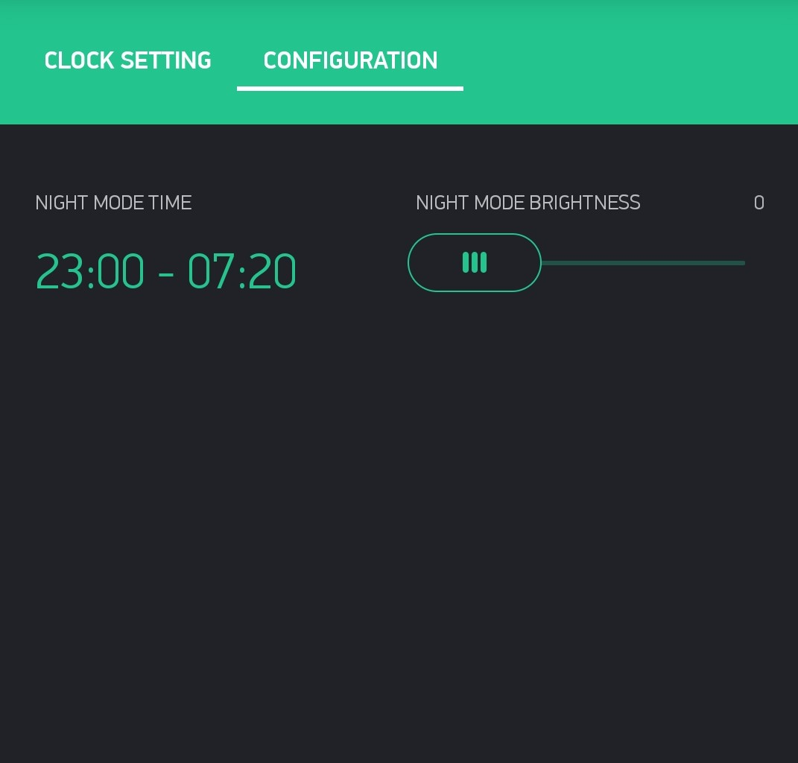

############################
Default blynk config
############################

This configuration is supposed to give all the basic functionality while also staying inside the free tier.
Optional elements can be added but these will need more energy than which is proved for free.
You can add and remove elements in the app you don't need without any problems to make it fit your needs.

****************
Minimal example
****************

This one has the minimal set of UI elements and can easily be replicated using only the free 2000 Energy:

+------------------+-------------+-------------------+-----+---------------------------------------------------------------------------------------------------------------------------------------------------------+
| Element          | Energy used | Purpose           | Pin | Comment                                                                                                                                                 |
+==================+=============+===================+=====+=========================================================================================================================================================+
| Vertical slider  | 200         | Global brightness | V0  | Range 0-100; One decimal; Send on release is off with interval of 100ms                                                                                 |
+------------------+-------------+-------------------+-----+---------------------------------------------------------------------------------------------------------------------------------------------------------+
| Segmented switch | 400         | Element selection | V1  | Element 1 is Hours; 2 is Minutes; 3 is Internal LEDs and 4 is seperation dot                                                                            |
+------------------+-------------+-------------------+-----+---------------------------------------------------------------------------------------------------------------------------------------------------------+
| zeRGBa           | 400         | Setting the color | V2  | Output -> Merge is on with default settings. Send on release is off with an interval of 100ms                                                           |
+------------------+-------------+-------------------+-----+---------------------------------------------------------------------------------------------------------------------------------------------------------+
| Time input       | 200         | Night time range  | V7  | Format -> HH:mm; allow start/stop input -> Yes; allow day of week selection -> No; Allow sunset/sunrise selection -> No; Allow Timezone selection -> No |
+------------------+-------------+-------------------+-----+---------------------------------------------------------------------------------------------------------------------------------------------------------+
| Menu             | 400         | Dot mode selector | V9  | (optional; can also just be statically set using Config.h) Element 1 is No Dot; 2 is One Dot and 3 is Two Dots                                          |
+------------------+-------------+-------------------+-----+---------------------------------------------------------------------------------------------------------------------------------------------------------+

Total Energy used: 1400 or if using the optional dot mode selector 1800

For easy cloning you can use this:

**********************
Fully featured example
**********************

This one is an extension of the minimal example to also include a Timer and an Alarm function.

.. image:: ../images/BlynkAppFull_main.jpg

In addition to the same elements used in the Minimal example this config has been extended by these elements:

+------------+-------------+-------------------+-----+---------------------------------------------------------------------------------------------------------------------------------------------------------+
| Element    | Energy used | Purpose           | Pin | Comment                                                                                                                                                 |
+============+=============+===================+=====+=========================================================================================================================================================+
| Time input | 200         | Timer setting     | V3  | Format -> HH:mm; allow start/stop input -> No; allow day of week selection -> No; Allow sunset/sunrise selection -> No; Allow Timezone selection -> No  |
+------------+-------------+-------------------+-----+---------------------------------------------------------------------------------------------------------------------------------------------------------+
| Button     | 200         | En/Dis-able Timer | V4  | Mode -> Switch                                                                                                                                          |
+------------+-------------+-------------------+-----+---------------------------------------------------------------------------------------------------------------------------------------------------------+
| Time input | 200         | Alarm setting     | V5  | Format -> HH:mm; allow start/stop input -> No; allow day of week selection -> Yes; Allow sunset/sunrise selection -> No; Allow Timezone selection -> No |
+------------+-------------+-------------------+-----+---------------------------------------------------------------------------------------------------------------------------------------------------------+
| Button     | 200         | En/Dis-able Alarm | V6  | Mode -> Switch                                                                                                                                          |
+------------+-------------+-------------------+-----+---------------------------------------------------------------------------------------------------------------------------------------------------------+

Total Energy used: 2200

For easy cloning you can use this:

