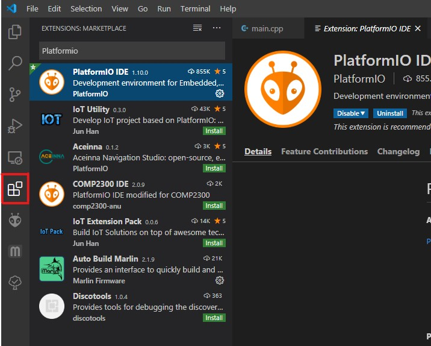
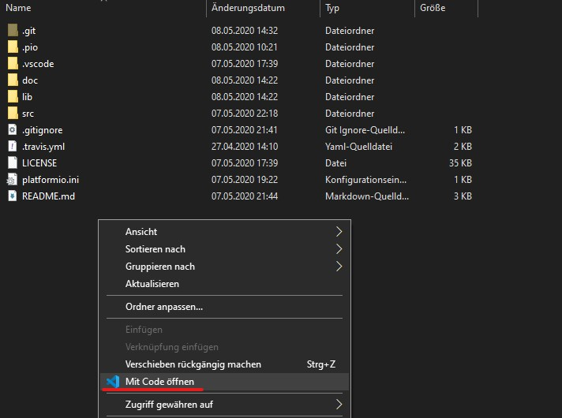
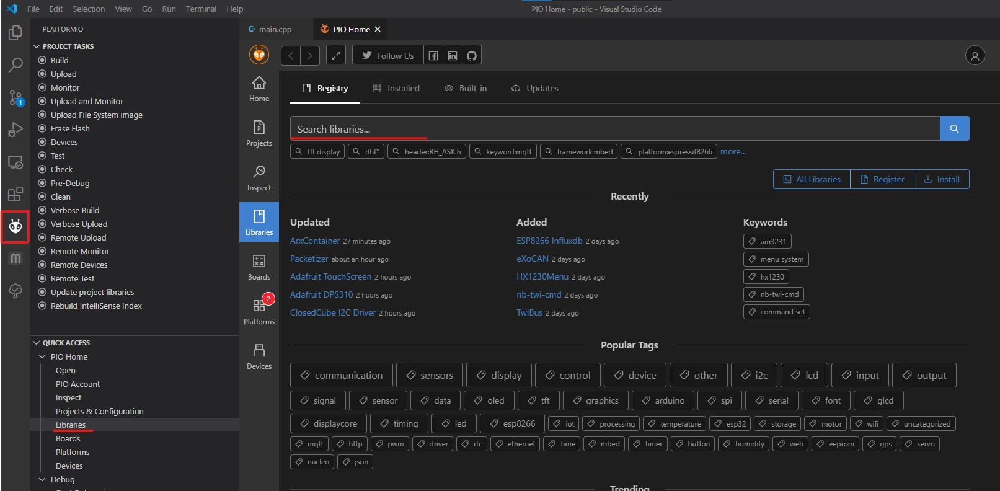

.. _Setup:

# The Development environment

I find the default Arduino IDE very hard to use if programming more than just basic functionality. This is why I decided to code all of this using Visual Studio code with PlatformIO.
It is free, easy to install, really powerful and almost as easy to use as the Arduino IDE.

## Step by step installation guide
1. Install VSCode from the official microsoft page [here.](https://code.visualstudio.com/)
To make things a bit easier you can enable the right click menut entry option during the VSCode installation.
2. Start VSCode and install PlatformIO from the extension menu in the sidebar.

3. Now download or clone the code from github, and put it to your hard drive. (Unzip it if you downloaded it)
4. navigate to the folder where you put your code and right click to open the Context menu and choose open VVSCode here:

5. After waiting for all the plugins to load you should see a PlatformIO button in your sidebar. Click on it and choose Libraries:

6. From here install the following libraries:
 * "Blynk" by Volodymyr Shymanskyy
 * "FastLED" by Daniel Garcia
 * "LinkedList" by Ivan Seidel
7. Now you can test if the build is working by hitting the little checkmark icon in the bottom bar of VScode. Uploading to the target is done by clicking the arrow button Just like in the Arduino IDE. You don't need to worry about your COM port as PlatformIO is smart enough to figure it out automatically.