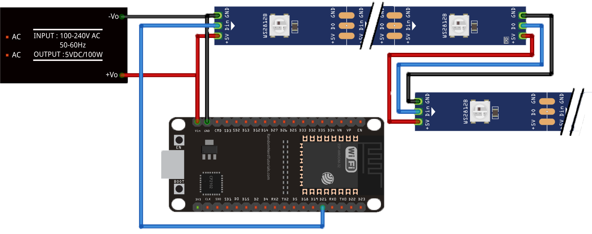
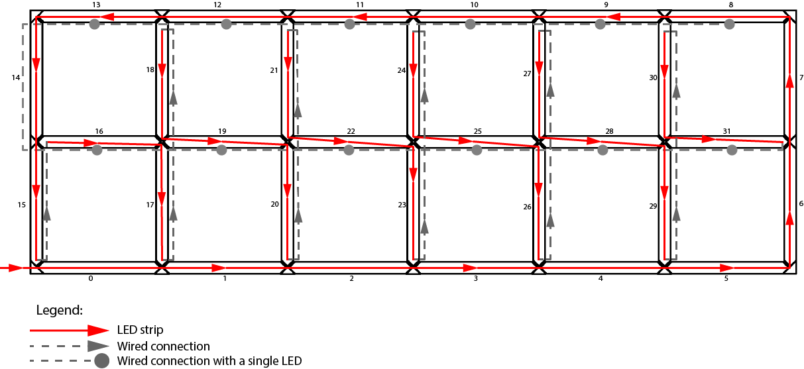

############################
Wiring setup
############################

Wiring of the ESP32 is highly customizable.
This can be changed and tweaked very easily by modifying the respective :ref:`main configuration <general-configuration>` file for your chosen config.

The following table are the default values that the code comes pre configured with:

+-------------------------+-----+--------------------------------+----------------------------------------------------------------------------------------------------------------------------------------------------------------------------------------------------------------+
| Connection              | Pin | Config parameter               | Comment                                                                                                                                                                                                        |
+=========================+=====+================================+================================================================================================================================================================================================================+
| LED strip data          | 21  | :code:`LED_DATA_PIN`           | (MANDATORY) This is the pin to which the LED strip is connected to.                                                                                                                                            |
+-------------------------+-----+--------------------------------+----------------------------------------------------------------------------------------------------------------------------------------------------------------------------------------------------------------+
| Internal LED strip data | 22  | :code:`DOWNLIGHT_LED_DATA_PIN` | (OPTIONAL) This is the pin to which the LED strip of the internal dowlighter LED's is connected to in case they are separated. This only takes effect if :code:`APPEND_DOWN_LIGHTERS` Is set to :code:`false`. |
+-------------------------+-----+--------------------------------+----------------------------------------------------------------------------------------------------------------------------------------------------------------------------------------------------------------+
| Light sensor            | 34  | :code:`LIGHT_SENSOR_PIN`       | (OPTIONAL) This is the pin to which the light sensor is connected in case it is enabled by setting :code:`ENABLE_LIGHT_SENSOR` to :code:`true`.                                                                |
+-------------------------+-----+--------------------------------+----------------------------------------------------------------------------------------------------------------------------------------------------------------------------------------------------------------+

***************
Default wiring
***************
This is the minimal wiring diagram according to the default configuration:

The WS2812B LED Strips should be wired together by connecting the pads like shown on the diagram above. The Connections of the LED strips in the default config is done like this:

*******************
Power Supply specs
*******************
The +5V and GND connections of the LED strip should be connected straight to a suitable 5V power supply. 
The ESP32 can also be connected straight to the power supply, just make sure to connect the +5V to the VIN pin and NOT the 3V pin!! 
The required wattage/Max current rating needed can be easily calculated: 
According to the manufacturer of the WS2813B LED's each LED consumes a maximum of 0.24W per piece. (figure taken form `here. <http://www.world-semi.com/Certifications/details-114-5_117.html>`_ ).

This means for the default configuration (32 Segments with 12 LED's each and an additional 12 downlighter LED's The power supply should at least be able to handle (32 * 12 + 12)*0.24 = 95W which is around 20A at 5V to have a little bit of headroom.